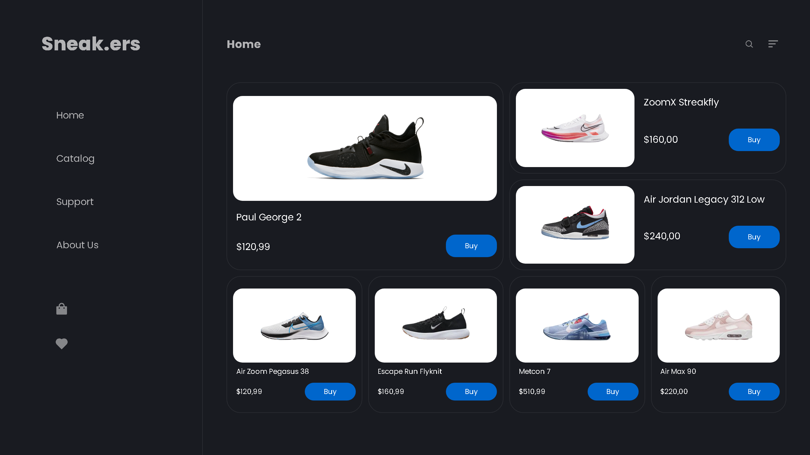
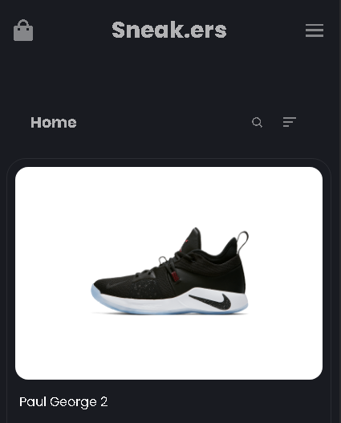
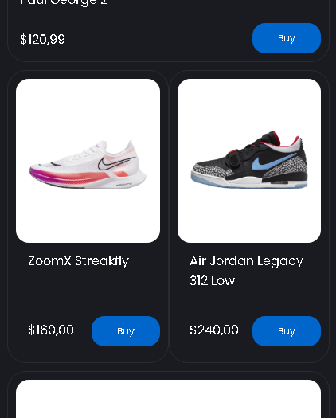

## 👀 Overview

Projeto apenas para teste de Grid Layout, com um tema que eu gosto muito que é e-commerce, principalmente de Tênis e assuntos esportivos. 

<h3 align="center">Desktop</h3>
 

<h3 align="center">Mobile 1</h3>
 

<h3 align="center">Mobile 1.1</h3>
 

 

## 💡 Ideia 

A ideia deste projeto é basicamente, o layout de uma SPA de um e-commerce de tênis, eu peguei diversas referências até chegar nesse design que eu mesmo projetei.
O principal intuito desse projeto era de pegar noção para começar a construir SPA e treinar CSS-GRID.

 

## ⚙️ Tools

 - HTML
 - CSS

 
 

## 🚀 Future
  

### Código
Como dito antes, este projeto provavelmente será levado para frente com React ou usado como inspiração para outra SPA e também, corrigir alguns possiveis erros de responsividade.

 
 

 
 
 
<h3 align="center"> Criado com muito ❤️ por <a href="https://github.com/VBrianB"> Vinicius Brian Bolzani</a></h2>

